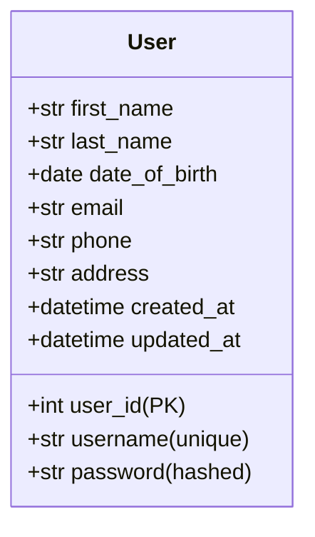
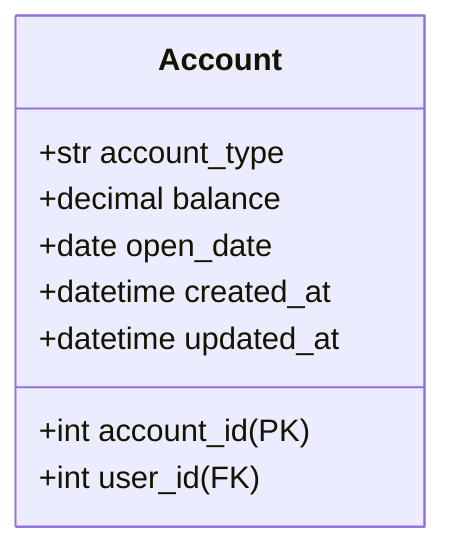
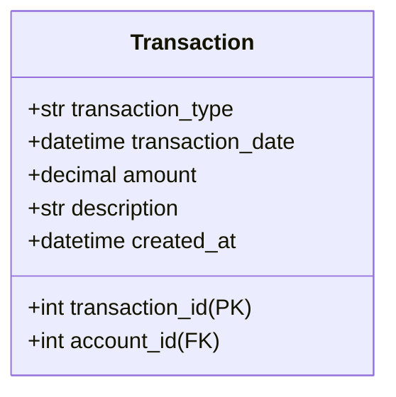
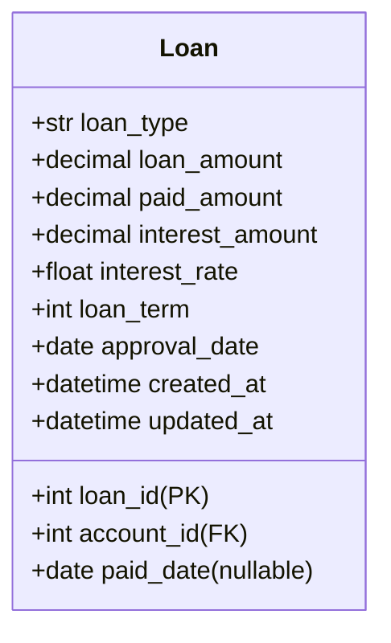
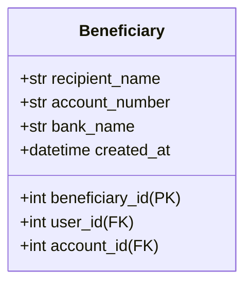
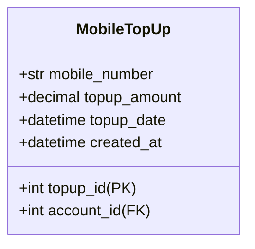
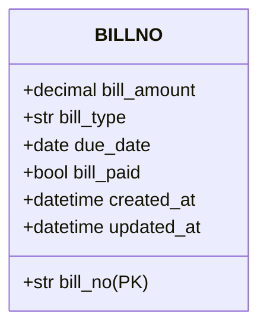
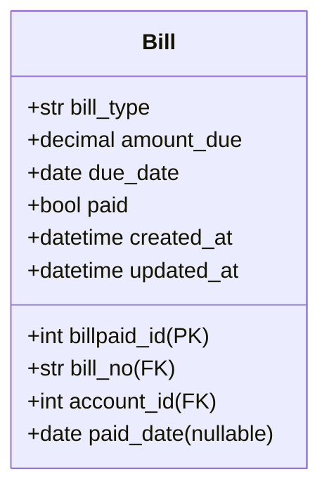

# Data Model: Banking Database API

## Entity Relationships

### User Entity

**Relationships:**
- One-to-many with Account (user_id → account.user_id)
- One-to-many with Beneficiary (user_id → beneficiary.user_id)

### Account Entity

**Relationships:**
- Many-to-one with User (account.user_id → user.user_id)
- One-to-many with Transaction (account_id → transaction.account_id)
- One-to-many with Loan (account_id → loan.account_id)
- One-to-many with Beneficiary (account_id → beneficiary.account_id)
- One-to-many with MobileTopUp (account_id → topup.account_id)
- One-to-many with Bill (account_id → bill.account_id)

### Transaction Entity

**Relationships:**
- Many-to-one with Account (transaction.account_id → account.account_id)

### Loan Entity

**Relationships:**
- Many-to-one with Account (loan.account_id → account.account_id)

### Beneficiary Entity

**Relationships:**
- Many-to-one with User (beneficiary.user_id → user.user_id)
- Many-to-one with Account (beneficiary.account_id → account.account_id)

### MobileTopUp Entity

**Relationships:**
- Many-to-one with Account (topup.account_id → account.account_id)

### BILLNO Entity

## Bill Entity

**Relationships:**
- Many-to-one with BILLNO (bill.bill_no → billno.bill_no)
- Many-to-one with Account (bill.account_id → account.account_id)

## Database Schema

### Table Creation Order
1. User
2. Account
3. BILLNO
4. Transaction
5. Loan
6. Beneficiary
7. MobileTopUp
8. Bill

### Indexes
- User.username (unique index)
- Account.user_id (foreign key index)
- Transaction.account_id (foreign key index)
- Loan.account_id (foreign key index)
- Beneficiary.user_id (foreign key index)
- Beneficiary.account_id (foreign key index)
- MobileTopUp.account_id (foreign key index)
- Bill.bill_no (foreign key index)
- Bill.account_id (foreign key index)

### Constraints
- User.username must be unique
- Account.balance must be >= 0
- Transaction.amount must be > 0
- Loan.loan_amount must be > 0
- Loan.paid_amount must be <= loan_amount
- MobileTopUp.topup_amount must be > 0
- Bill.amount_due must be > 0